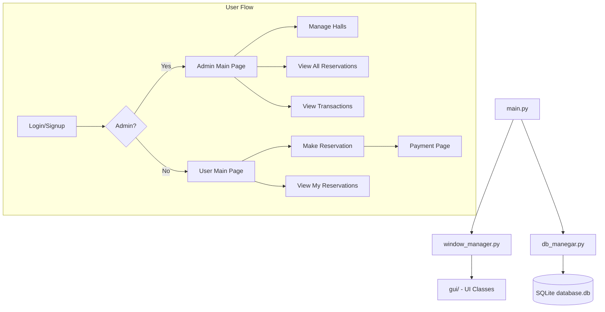
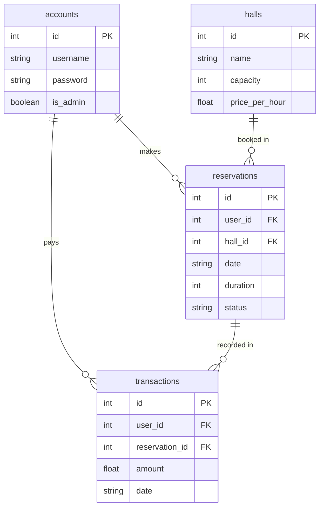

# Architecture Overview

## System Flow

## Database Schema

## File Roles

| File | Purpose |
|---|---|
| `main.py` | Entry point. Contains all business logic: login, signup, reservations, payments, table population. |
| `window_manager.py` | Creates all windows, wires button signals to handlers, manages navigation between pages. |
| `db_manegar.py` | Handles all database operations. Creates tables on init, provides CRUD methods for accounts, halls, reservations, and transactions. |
| `gui/*.py` | Auto-generated from Qt Designer `.ui` files. Each file defines the widget layout for one window. |
| `UI/*.ui` | Qt Designer XML files. These are the source files for the GUI layouts. |
